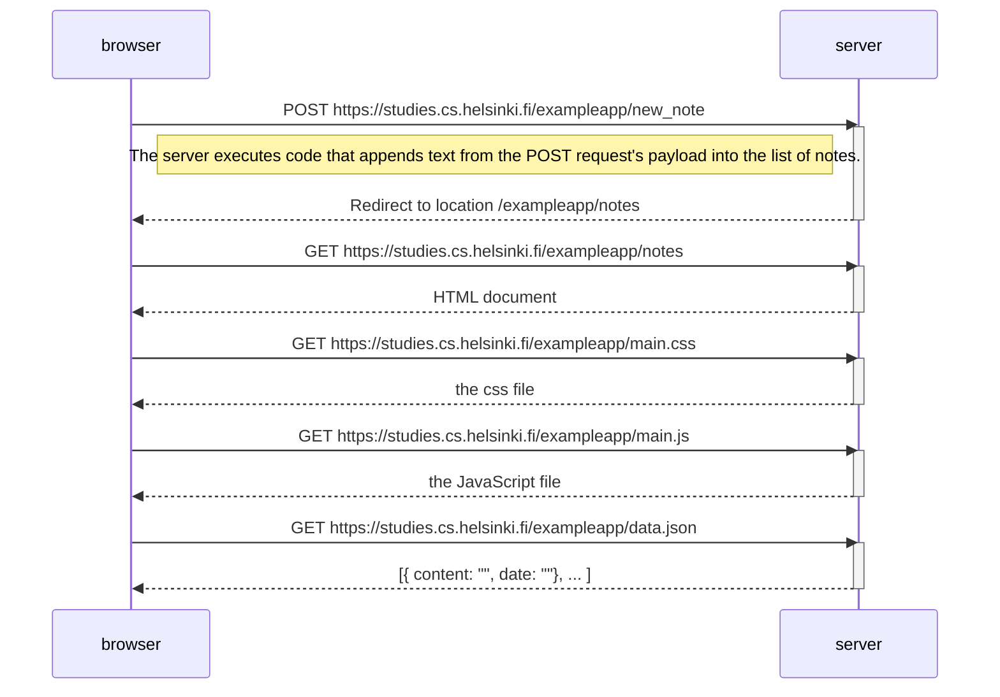
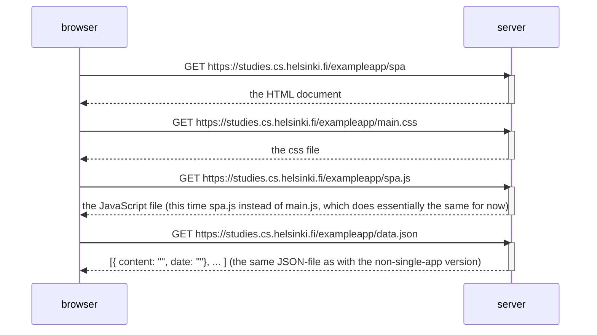
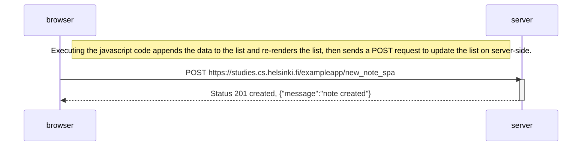

# Part0 assignments

## Assignment 0.4

The sequence is almost identical to just refreshing the page: there's just an extra HTTP-request (POST) at the start.

## Assignment 0.5

Almost identical to refreshing "/exampleapp/notes", all the resources just get loaded one by one. 

## Assignment 0.6

